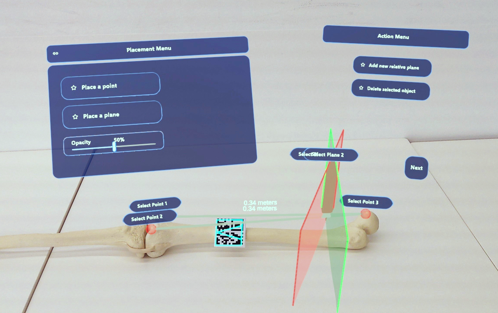

# AR Bone Template
This Unity project is part of the mixed reality course at ETH exploring augmented reality (AR) applications for enhancing surgical procedures. The system focuses on visualizing and aligning holographic calibrations elements (points and planes) to physical reference objects, such as bones, leveraging the Microsoft HoloLens 2 and MRTK3.

## Overview
During bone surgery, we must make cuts at precise angles, or insert wires into the bone at specific distances or angles between each other.
Using AR glasses, the surgeon can create and manipulate virtual planes, lines or points and place them over the bone at different positions and orientations. Using qr codes as anchors they remain in place, so the surgeon can make cuts (osteotomies) following such planes, or measure distances between two spots or measure angulations.

## Scenes
The project consists of 2 scenes which you can find under Assets/Scenes:
- `MainScene`: The MainScene, is where you will land when you launch the application. You will be asked if you want to do a quick tutorial. If you press yes, the TutorialScene will be loaded. Otherwise you you will continue on the MainScene where you can start placing points and planes, and measure distances or rotate the placed planes.
- `TutorialScene`: In this scene the user will be guided through a small surgery planning for the femur.

## Installation & Build
1. Install [git lfs](https://git-lfs.com/) if you haven't yet
2. Clone the repository
3. Open the project in Unity version 2022.3.48f1

## Build & Deployment
1. Go to `Build Settings`
2. Switch `Platform` to `Universal Windows Platform`
3. Change `Architecture` to `ÀRM 64-bit`
4. Press the `Build` button to build the visual studio solution.
5. Open the `AR Bone Template.sln` file (in visual studio) inside the build folder
6. Switch to `Release` mode
7. Switch to the `ARM64` platform
8. Deploy the app to your HoloLens2

## Supervisor
- Matthias Rüger, MD, Zurich
- Javier Narbona Cárceles, MD PhD, Madrid

